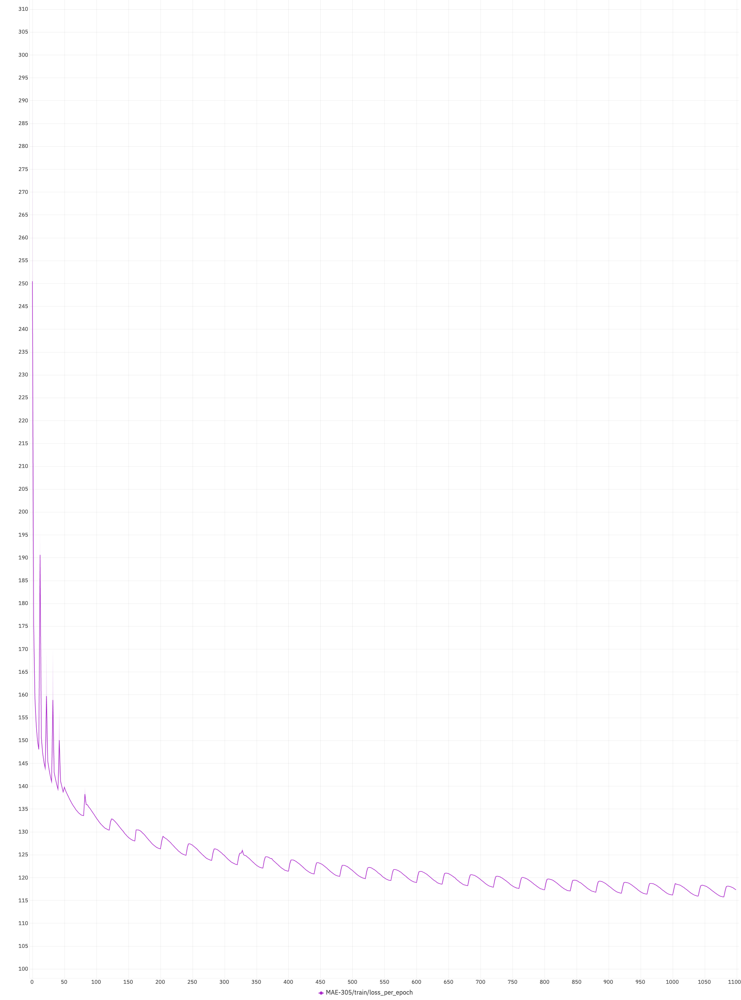
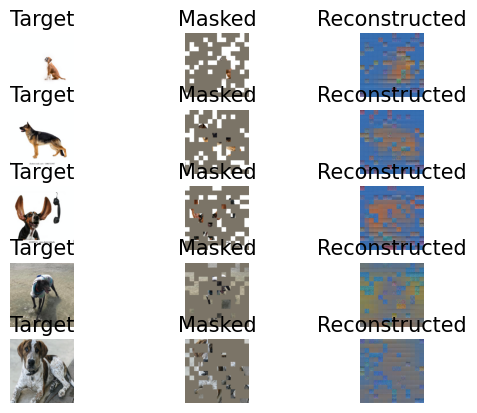
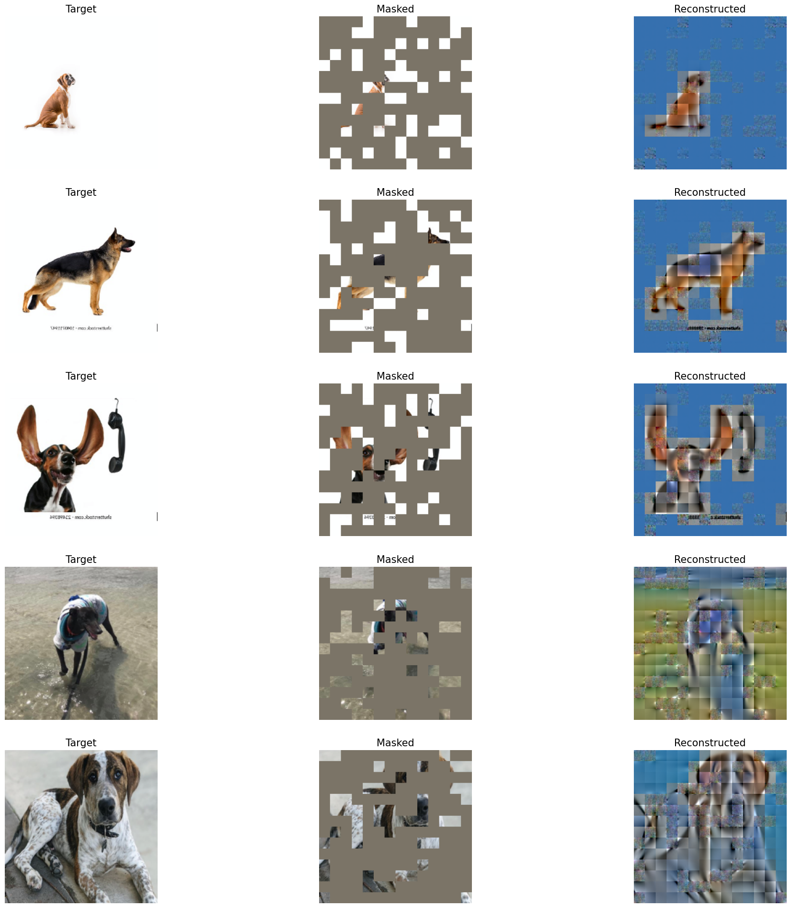

# Masked-AutoEncoder PyTorch 2.1.0

This project is an unofficial implementation of [MAE](https://arxiv.org/pdf/2111.06377) with the support of [Beneufit, Inc.](https://beneufit.com/). Transformers were built purely using PyTorch and Einops library. Positional Encoding token modules were also implemented in reference to the original [vision transformers' paper](https://arxiv.org/pdf/2010.11929). 

The idea of MAE is to leverage a huge set of unlabelled data (images) to learn rich representations of the dataset. These learned representations can then be utilized in downstream tasks such as classification, clustering, image segmentation, or anomaly detection, significantly enhancing performance by providing a strong, pre-trained feature extractor that adapts well to various applications.

## Experimental Results

### Dataset
I segregated the dataset from [Kaggle's Doges 77 Breeds](https://www.kaggle.com/datasets/madibokishev/doges-77-breeds) into three parts. About 10k images (labelled) to train the downstream classification part. About 5k images (labelled) to be used for testing/evaluating the final downstream-ed model. And, lastly the remaining data (labels removed) to train the MAE itself without any labels (about 300k+ images). There were also a few thousands of random dog pictures included in this last set.

### MAE Training

The pre-training part (training the MAE model itself) was done using 2 RTX 4090, 32GB RAM and 16 cores of AMD Ryzen CPU. 

The configurations used during the training is the exact same as in ```Masked-AutoEncoder-PyTorch/configs/pretrain/mae_pretrain_224_16.yaml```.

The MAE's training loss is as shown below. The loss is not smooth due to the use of cosine annealing strategy, but I believe that cosine annealing contributed greatly to the overall reduction of loss from few experiments.

<div align="center"> 
<b>Training loss of MAE</b>
</div>
<figure class="image">
  <div align="center"></div>
  <div align="center"><figcaption>Loss over 1100 epochs</figcaption></div>
</figure>

Meanwhile, the reconstructions output of MAE were plotted every 2 epochs. All the reconstructions can be found in the ```train_reconstructions``` folder. Figure below shows the reconstruction result on the first epoch and the last epoch.

<!--<div align="center"> -->
<!--  <b>Training Loss of MAE</b>-->
<!--</div>-->
<!--<figure class="image">-->
<!--  <div style="display: flex; justify-content: center;">-->
<!--    <div align="center" style="margin: 0 10px;">-->
<!--      -->
<!--      <figcaption>First epoch's reconstruction result.</figcaption>-->
<!--    </div>-->
<!--    <div align="center" style="margin: 0 10px;">-->
<!--      -->
<!--      <figcaption>Final epoch's reconstruction result.</figcaption>-->
<!--    </div>-->
<!--  </div>-->
<!--</figure>-->

|  |  |
|:--:|:--:|
| Loss over 1100 epochs - Image 1 | Loss over 1100 epochs - Image 2 |

It is evident that the MAE was learning as intended. However, I could not get a really nice reconstruction as reported in the paper probably due to the size of my dataset and the relatively small architecture of MAE.

### Downstream Training

Using the weights of the encoder from the MAE above, classifier layers were added and fine-tuned. The fine-tuning is done by freezing the weights of the encoder fully. The result on the 10k dataset as mentioned is as below.


## Pretraining the MAE

In order to train the MAE model - we'll call it pretraining since we're going to use this trained MAE to retrain again on a classification task. 

First, install the required packages from **requirements.txt**. 

To start the pretraining, first place a folder of dataset (unlabelled) and change the configurations at ```Masked-AutoEncoder-PyTorch/configs/pretrain/mae_pretrain_224_16.yaml``` appropriately. Next, run

```
python pretrain.py --config configs/pretrain/mae_pretrain_224_16.yaml --logging_config configs/pretrain/logging_pretrain.yaml
```

During the training, the visualizations of the reconstruction will be saved in the ```figures``` folder. You can refer to my results in the folder.

## Classification Downstream

Make sure that the weights of the pretrained model is placed at the appropriate location (depends on your configurations) and that the same configurations on the model from pretraining is used here as well at ```Masked-AutoEncoder-PyTorch/configs/finetune/mae_finetune_224_16.yaml```. Here, the dataset needs to be labelled - place the images separately in folders according to their classes. Then, start the training with

```
python finetune.py --config configs/finetune/mae_finetune_224_16.yaml --logging_config configs/finetune/logging_finetune.yaml
```

## Acknowledgement
I extend my sincere gratitude to [Beneufit, Inc.](https://beneufit.com/) for their generous funding and support. Their commitment to innovation made this project possible and has been a source of inspiration for me. Thank you, [Beneufit, Inc.](https://beneufit.com/), for your invaluable contribution.

## License

[![CC BY-NC 4.0][cc-by-nc-shield]][cc-by-nc]

This work is licensed under a [Creative Commons Attribution-NonCommercial 4.0 International License][cc-by-nc].

[cc-by-nc]: https://creativecommons.org/licenses/by-nc/4.0/
[cc-by-nc-shield]: https://licensebuttons.net/l/by-nc/4.0/80x15.png


