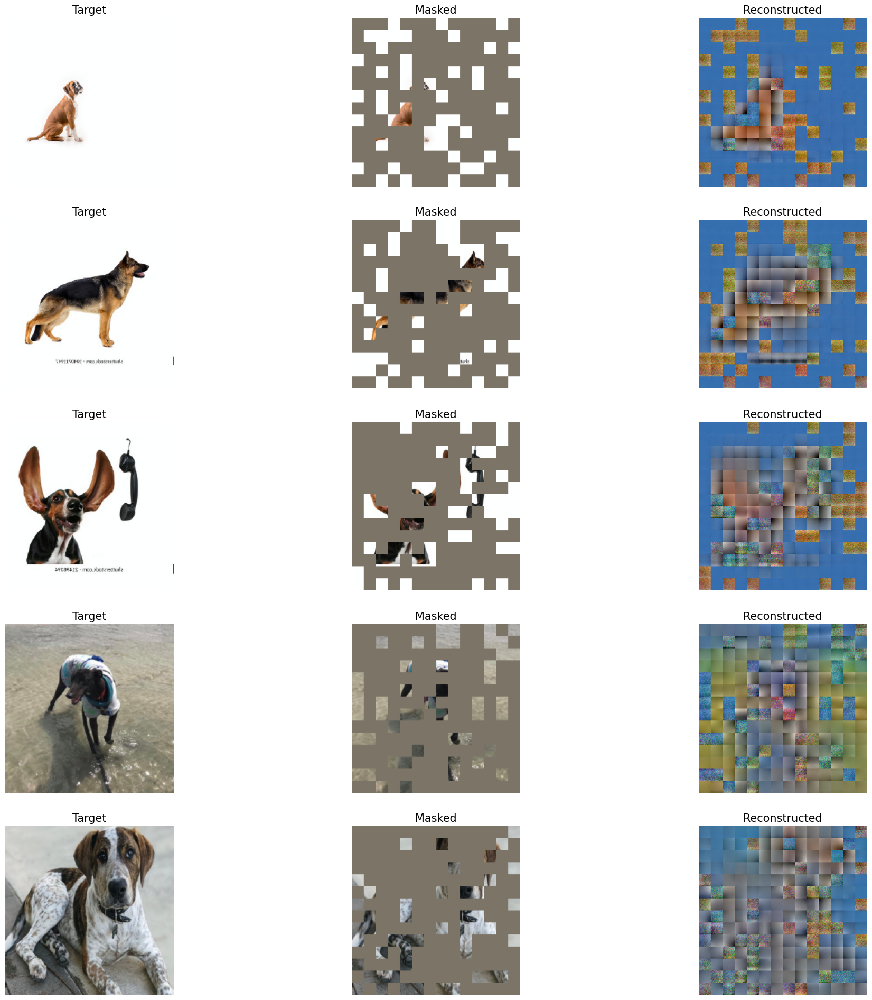
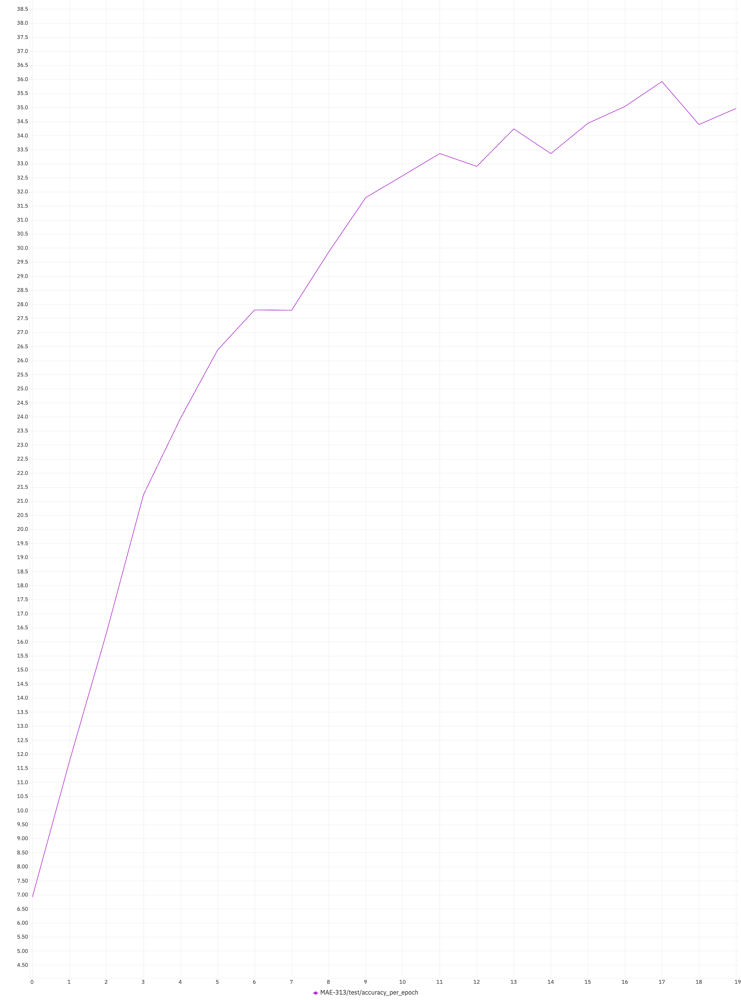
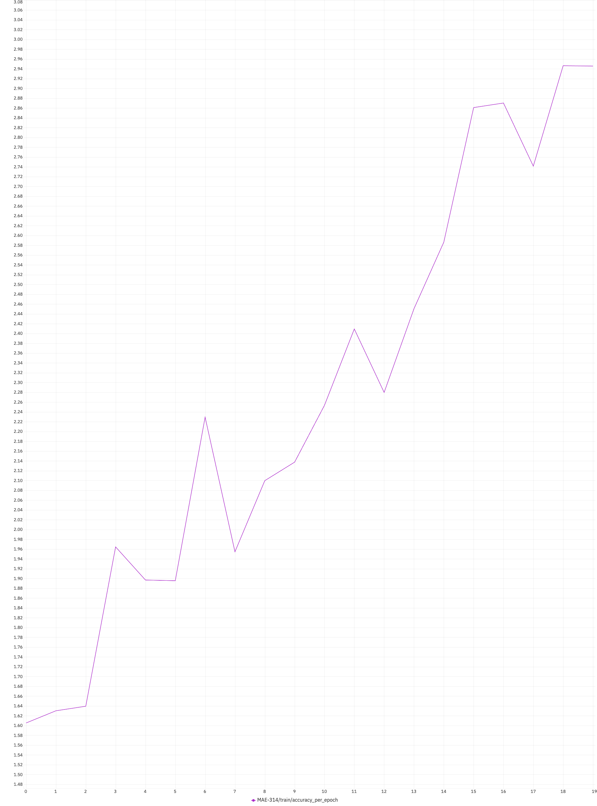
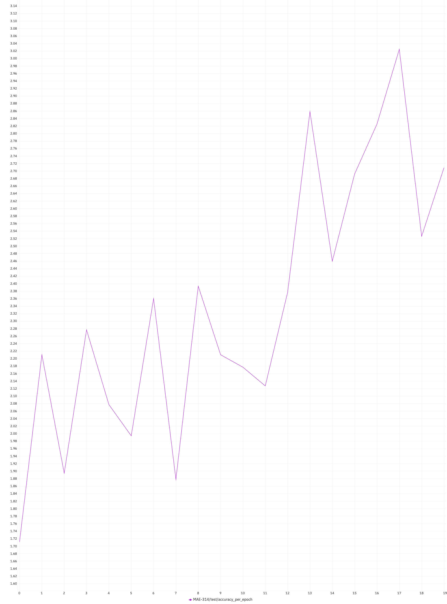

# Table of Contents
1. [Introduction](#introduction)
2. [Experimental Results](#ExperimentalResults)
3. [Usage](#usage)
4. [Contributing](#contributing)
5. [License](#license)


# Introduction

This project is an unofficial implementation of [MAE](https://arxiv.org/pdf/2111.06377) with the support of [Beneufit, Inc.](https://beneufit.com/). Transformers were built purely using PyTorch and Einops library. Positional Encoding token modules were also implemented in reference to the original [vision transformers' paper](https://arxiv.org/pdf/2010.11929). 

The idea of MAE is to leverage a huge set of unlabelled data (images) to learn rich representations of the dataset. These learned representations can then be utilized in downstream tasks such as classification, clustering, image segmentation, or anomaly detection, significantly enhancing performance by providing a strong, pre-trained feature extractor that adapts well to various applications.

# Experimental Results

## Dataset
I segregated the dataset from [Kaggle's Doges 77 Breeds](https://www.kaggle.com/datasets/madibokishev/doges-77-breeds) into three parts. About 10k images (labelled) to train the downstream classification part. About 5k images (labelled) to be used for testing/evaluating the final downstream-ed model. And, lastly the remaining data (labels removed) to train the MAE itself without any labels (about 300k+ images). There were also a few thousands of random dog pictures included in this last set.

## MAE Training

The pre-training part (training the MAE model itself) was done using 2 RTX 4090, 32GB RAM and 16 cores of AMD Ryzen CPU. 

The configurations used during the training is the exact same as in ```Masked-AutoEncoder-PyTorch/configs/pretrain/mae_pretrain_224_16.yaml```.

The MAE's training loss is as shown below. Cosine annealing was used as the learning rate strategy. I believe cosine annealing, though produces unsmooth loss graph, is the best way to reach a global optima.

<div align="center"> 
<b>Training loss of MAE</b>
</div>
<figure class="image">
  <div align="center"></div>
  <div align="center"><figcaption>Loss over 1100 epochs</figcaption></div>
</figure>

Meanwhile, the reconstructions output of MAE were plotted at every 2 epochs. All the reconstructions can be found in the ```train_reconstructions``` folder. Figure below shows the reconstruction result from the 3rd epoch and the last epoch.


|  |  |
|:--:|:--:|
| Reconstruction at epoch 2 | Reconstruction at epoch 1100 |

It is evident that the MAE was learning as intended. However, I could not achieve a near-perfect reconstruction as reported in the paper. This is probably due to the size of my dataset and the relatively small architecture of MAE used.

## Downstream Training

Using the weights of the encoder from the MAE above, classifier layers were added and fine-tuned. The fine-tuning is done by freezing the weights of the encoder fully. The results on the 10k downstream training dataset and the 5k testing dataset as mentioned previously are as below.

|  |  |
|:--:|:--:|
| Train Accuracy with MAE | Test Accuracy with MAE |

Both the training and testing above were done on their respective dataset as previously described. In just 20 epochs, the training accuracy reached about 41% for the 77 classes while the test accuracy reached about 35%.

## Downstream Comparison

As a sanity check, I ran another identical expriment of the downstream task except that this time, the pretrained weights of MAE's encoder were not loaded.

|  |  |
|:--:|:--:|
| Train Accuracy without MAE | Test Accuracy without MAE |

The accuracies barely reached 3% over the 20 epochs. It's clear that the weights from the pretrained MAE encoder makes a large difference. This goes to show that the concept of MAE works. 

# Pretraining the MAE

In order to train the MAE model - we'll call it pretraining since we're going to use this trained MAE to retrain again on a classification task. 

First, install the required packages from **requirements.txt**. 

To start the pretraining, first place a folder of dataset (unlabelled) and change the configurations at ```Masked-AutoEncoder-PyTorch/configs/pretrain/mae_pretrain_224_16.yaml``` appropriately. Next, run

```
python pretrain.py --config configs/pretrain/mae_pretrain_224_16.yaml --logging_config configs/pretrain/logging_pretrain.yaml
```

During the training, the visualizations of the reconstruction will be saved in the ```figures``` folder. You can refer to my results in the ```train_reconstructions``` folder.

# Classification Downstream

Make sure that the weights of the pretrained model is placed at the appropriate location (depends on your configurations) and that the same configurations on the model from pretraining is used here as well at ```Masked-AutoEncoder-PyTorch/configs/finetune/mae_finetune_224_16.yaml```. Here, the dataset needs to be labelled - place the images separately in folders according to their classes. Then, start the training with

```
python finetune.py --config configs/finetune/mae_finetune_224_16.yaml --logging_config configs/finetune/logging_finetune.yaml
```

# Acknowledgement
I extend my sincere gratitude to [Beneufit, Inc.](https://beneufit.com/) for their generous funding and support. Their commitment to innovation made this project possible and has been a source of inspiration for me. Thank you, [Beneufit, Inc.](https://beneufit.com/), for your invaluable contribution.

# Future Works

I will further continue the experiments with other computer vision tasks such as object localization and pose estimations with the same trained weights. The objective here is to investigate whether or not that MAE is useful for various different computer vision tasks other than classification.


# License

[![CC BY-NC 4.0][cc-by-nc-shield]][cc-by-nc]

This work is licensed under a [Creative Commons Attribution-NonCommercial 4.0 International License][cc-by-nc].

[cc-by-nc]: https://creativecommons.org/licenses/by-nc/4.0/
[cc-by-nc-shield]: https://licensebuttons.net/l/by-nc/4.0/80x15.png


